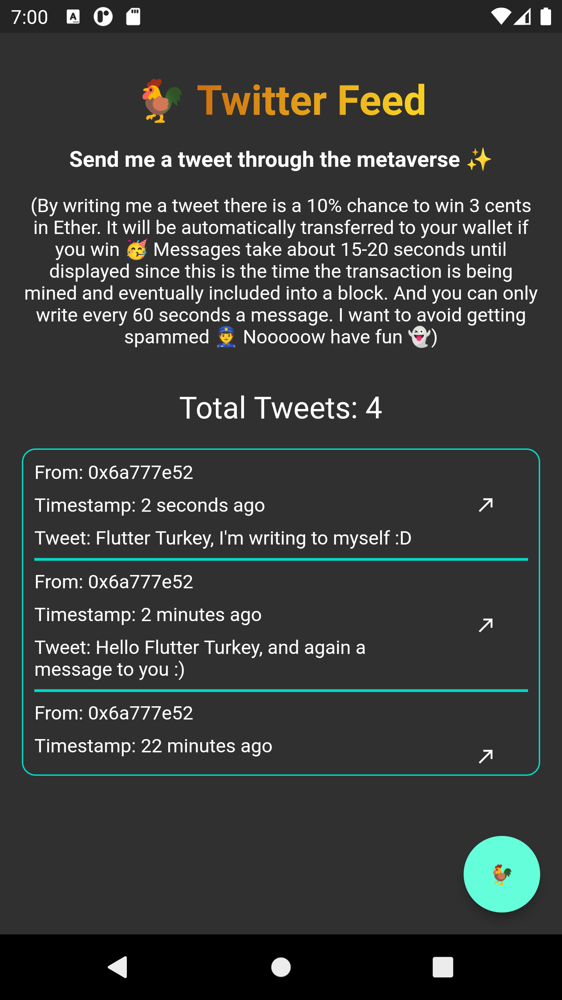

# Flutter & Web3 Twitter Feed

A web3 Twitter Feed using Flutter as Frontend and Solidity as Backend 

## 🏗 Structure

The smart_contract folder consists of everything it needs to run and deploy a smart contract. The
smart contract used in this example is also in there right under `smart_contract/contracts`. More info
on that in [Smart Contract README](https://github.com/MuTe33/Flutter-Web3-Twitter/blob/main/smart_contract/README.md).

## 💙 Purpose

This project demonstrates core principles of a decentralized app (dApp) that is reading, writing 
from/to the blockchain and listen for event. 

## 🐵 What to expect

This project is a couple of days hack, use this as a building block or to get the gist. Many stuff is
missing here. 

- not all error cases covered
- private key must be adjusted in code, there is no screen to save it nor wallet connect is added 
- UI could be way better 🥲

## Some Notes

- You need a API key from [Infura](https://infura.io/) or [Alchemy](https://www.alchemy.com/). These
are providing nodes which we are using to access the blockchain
- To make some transactions you can get some free ETH for the rinkeby test network here:
  1) https://faucet.rinkeby.io/
  2) https://app.mycrypto.com/add-account
  3) https://buildspace-faucet.vercel.app/
  4) https://faucets.chain.link/rinkeby

## 🥳 Contributions

Open a PR and contribute. More then welllllllcommmeeeeee!

## 🐓 How the app looks like

  

 

